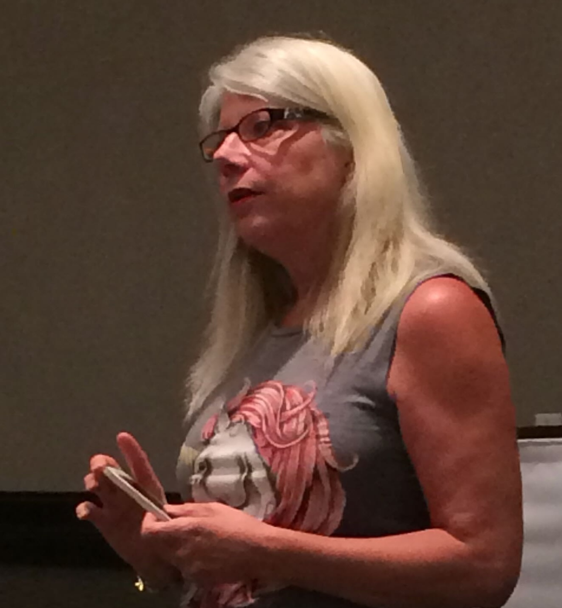

```{=html}
<style>
  .profile-layout {
    display: grid;
    grid-template-columns: 240px 1fr;
    gap: 3rem;
    margin-top: 2rem;
  }

  .profile-sidebar {
    display: flex;
    flex-direction: column;
    align-items: center;
    text-align: center;
    gap: 1rem;
  }

  .profile-sidebar img {
    width: 220px;
    height: 280px;
    object-fit: cover;
    object-position: center top;
    border-radius: 4px;
  }

  .profile-name {
    font-size: 1.4rem;
    font-weight: 500;
    margin: 0;
  }

  .profile-links {
    display: flex;
    flex-wrap: wrap;
    justify-content: center;
    gap: 0.4rem;
    margin-top: 0.25rem;
  }

  .profile-links a {
    font-size: 0.8rem;
    border: 1px solid #ccc;
    border-radius: 4px;
    padding: 2px 10px;
    color: inherit;
    text-decoration: none;
    transition: background 0.15s;
  }

  .profile-links a:hover {
    background: #f0f0f0;
  }

  .profile-main h2 {
    font-size: 1.4rem;
    font-weight: 500;
    margin-top: 1.75rem;
    margin-bottom: 0.5rem;
    border-bottom: 1px solid #e0e0e0;
    padding-bottom: 0.25rem;
  }

  .profile-main h2:first-child {
    margin-top: 0;
  }

  .profile-main p {
    line-height: 1.7;
    margin-bottom: 0.75rem;
  }

  .edu-entry {
    margin-bottom: 1rem;
  }

  .edu-entry strong {
    display: block;
    font-weight: 500;
  }

  .edu-entry .edu-location {
    color: #666;
    font-size: 0.9rem;
    margin-bottom: 0.2rem;
  }

  .edu-entry .edu-degree {
    font-size: 0.9rem;
    margin: 0;
    line-height: 1.6;
  }

  @media (max-width: 700px) {
    .profile-layout {
      grid-template-columns: 1fr;
    }
    .profile-sidebar img {
      width: 180px;
      height: 220px;
    }
  }
</style>

<div class="profile-layout">

  <div class="profile-sidebar">
    
    <p class="profile-name">Bo Laurent</p>
    <div class="profile-links">
      <a href="https://www.linkedin.com/in/bolaurent/" target="_blank">LinkedIn</a>
      <a href="https://x.com/bolaurent" target="_blank">Twitter</a>
      <a href="/contact.html">Email</a>
    </div>
  </div>

  <div class="profile-main">

    <h2>Bio</h2>

    <p>Writer and researcher working at the intersection of intersex advocacy, Japanese history, and historical manuscripts.</p>

    <p>I've spent decades in the intersex rights movement, and I'm also drawn to the quiet work of reading old Japanese documents — 古文書 — that most people will never see. This site is where those threads live alongside each other.</p>

    <p>See more at <a href="/about.html">About Bo</a></p>

    <h2>Recent Posts</h2>

    <div id="recent-posts"></div>

  </div>

</div>
```
